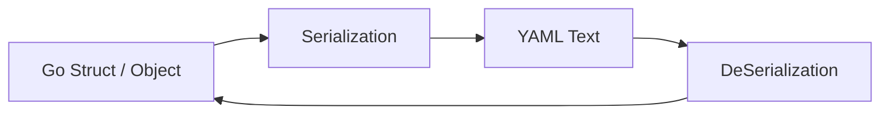
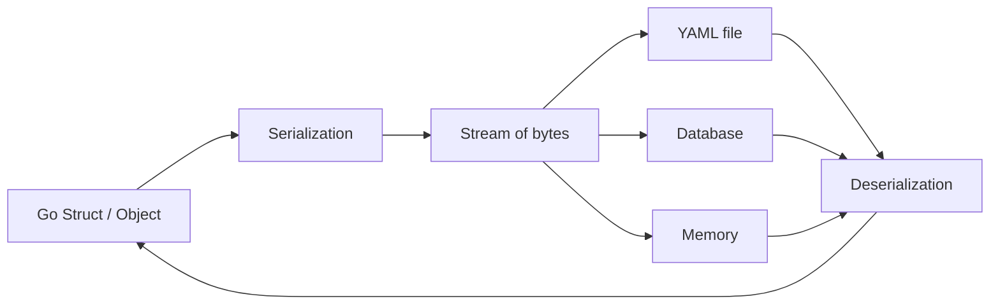

# YAML - YAML ain't markup language

## What is YAML?

YAML is a human-readable data serialization language used to represent structured data.

It is commonly used for:

- Configuration files
- Docker Compose files
- Kubernetes manifests
- CI/CD pipelines
- Data exchange between systems

YAML focuses on readability and simplicity.

---

# Data Serialization

Before learning YAML, it's important to understand the problem that YAML is trying to solve.

Applications store data in memory as objects, structs, arrays, maps, and other data structures. However, memory is temporary. If we want to save data to a file, send it over a network, or share it with another application, we need a way to convert that data into a portable format.

This process is called **serialization**.



For example, a Go struct might exist in memory like this:

```go
type User struct {
    Name string
    Age  int
}

user := User{
    Name: "Ansh",
    Age: 20,
}
```

After serialization, the same data can be represented as YAML:

```yaml
name: Ansh
age: 20
```

This YAML text can then be:

- Saved to a file
- Stored in a database
- Sent across a network
- Shared between different applications

The reverse process is called **deserialization**, where YAML is converted back into an object in memory.



YAML is just one serialization format. Other common formats include:

- JSON
- XML
- Protocol Buffers
- MessagePack

YAML is especially popular for configuration files because it is designed to be easy for humans to read and write.

## YAML Stands For

Originally:

YAML = Yet Another Markup Language

Current official meaning:

YAML = YAML Ain't Markup Language

This emphasizes that YAML is a data format, not a markup language like HTML or XML.

---

## JSON and YAML

JSON and YAML are both used to represent structured data.

Example in JSON:

```json
{
  "name": "Ansh",
  "age": 20
}
```

Example in YAML:

```yaml
name: Ansh
age: 20
```

YAML is generally easier for humans to read and write because it relies on indentation instead of braces and commas.

JSON can be considered a subset of YAML.

---

## Important Characteristics

- Human-readable
- Uses indentation to represent structure
- Stores data only
- Does not contain programming logic such as loops, functions, or if-else statements
- Frequently used for configuration files

---

## Basic Key-Value Pairs

```yaml
name: Ansh
age: 20
city: Bhopal
```

Equivalent JSON:

```json
{
  "name": "Ansh",
  "age": 20,
  "city": "Bhopal"
}
```

---

## Lists

```yaml
languages:
  - Go
  - C++
  - JavaScript
```

Equivalent JSON:

```json
{
  "languages": ["Go", "C++", "JavaScript"]
}
```

---

## Objects

```yaml
user:
  name: Ansh
  age: 20
```

Equivalent JSON:

```json
{
  "user": {
    "name": "Ansh",
    "age": 20
  }
}
```

---

## Why Docker Compose Uses YAML

Docker Compose needs a way to describe:

- Containers
- Networks
- Volumes
- Environment variables
- Ports

YAML makes these configurations easy to read and edit.

Example:

```yaml
services:
  mongo:
    image: mongo

  mongo-express:
    image: mongo-express
```

---

## Key Takeaway

YAML is a human-friendly format for storing structured data.

Think of YAML as a way to describe data and configuration, not a way to write programs.
